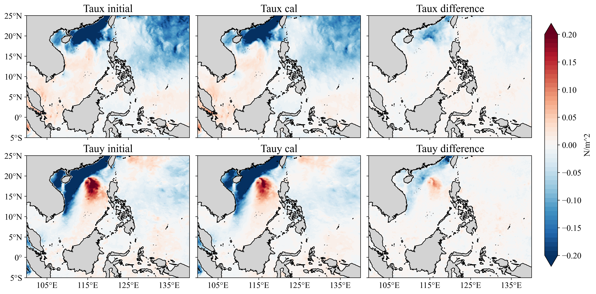
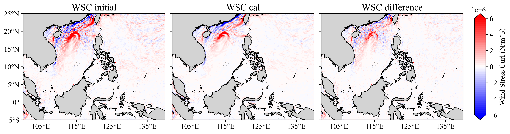

# Wind-Stress-and-Wind-Stress-Curl-Calculation

This repository provides Python implementations for calculating **wind stress** and **wind stress curl**, offering an accessible alternative to existing MATLAB and FORTRAN scripts.  
Building upon **Ramkrushn Patel’s MATLAB code**, this version refines the **drag coefficient** for high wind speeds and corrects several minor issues to improve accuracy and usability.

---

## 🌀 Usage

```python
from windstress import ra_windstr
from windstress_curl import ra_windstrcurl

# Calculate wind stress components
taux_cal, tauy_cal = ra_windstr(u, v)

# Calculate wind stress curl
WSC_cal = ra_windstrcurl(lat, lon, u, v)
```
---

## 📊 Validation
### Compare our results with the initial wind stress and wind stress curl data
We randomly choose a snapshot (2025-10-20T 12:00) from [Global Ocean Hourly Sea Surface Wind and Stress from Scatterometer and Model](https://data.marine.copernicus.eu/product/WIND_GLO_PHY_L4_NRT_012_004/description) data to validate the our scripts' result.
We use the initial wind to compute the wind stress and wind stress curl. Our result is very simillar to the raw data. 

### **Figure 1.** Comparison of Wind Stress


### **Figure 2.** Comparsion of Wind Stress Curl


---

## 📁 Repository Structure
```shell
Wind-Stress-and-Wind-Stress-Curl-Calculation/
├── windstress.py                # Compute wind stress from wind components
├── windstress_curl.py           # Compute wind stress curl
├── test_compare.ipynb           # Validation and visualization notebook
├── cmems_obs-wind_glo_phy_nrt_l4_0.125deg_PT1H_1761115052002.nc  # CMEMS wind data
├── output.png                   # Wind stress comparison figure
├── output2.png                  # Wind stress curl comparison figure
├── LICENSE
└── README.md
```

